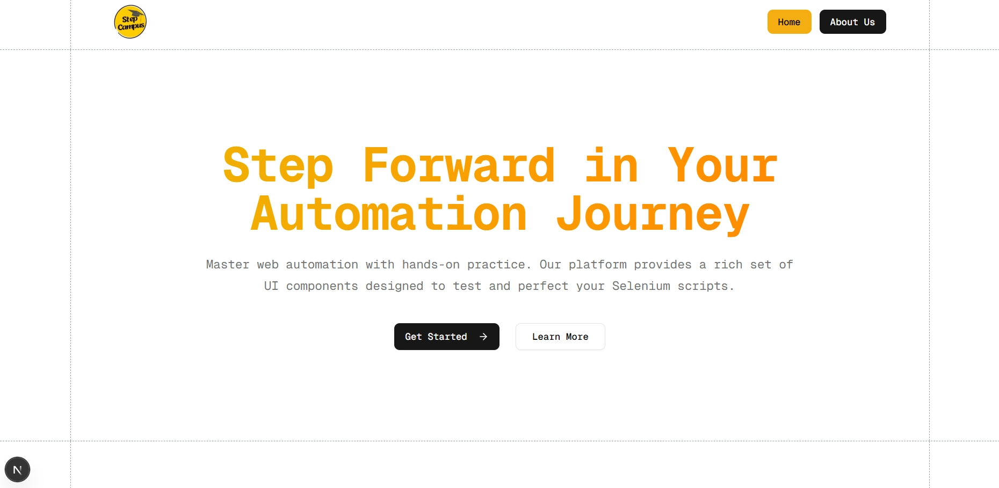
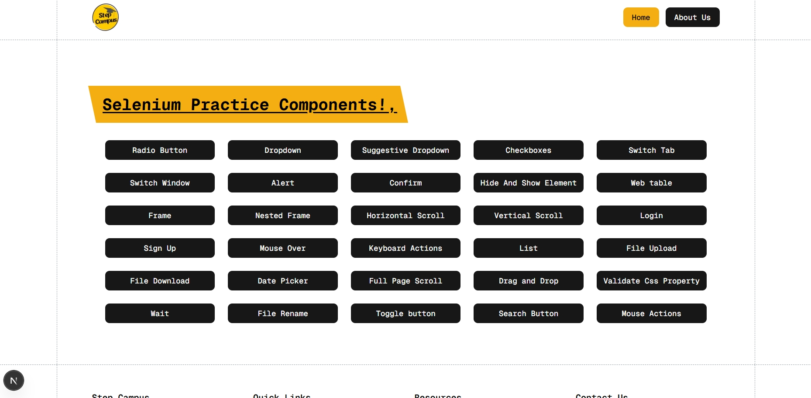
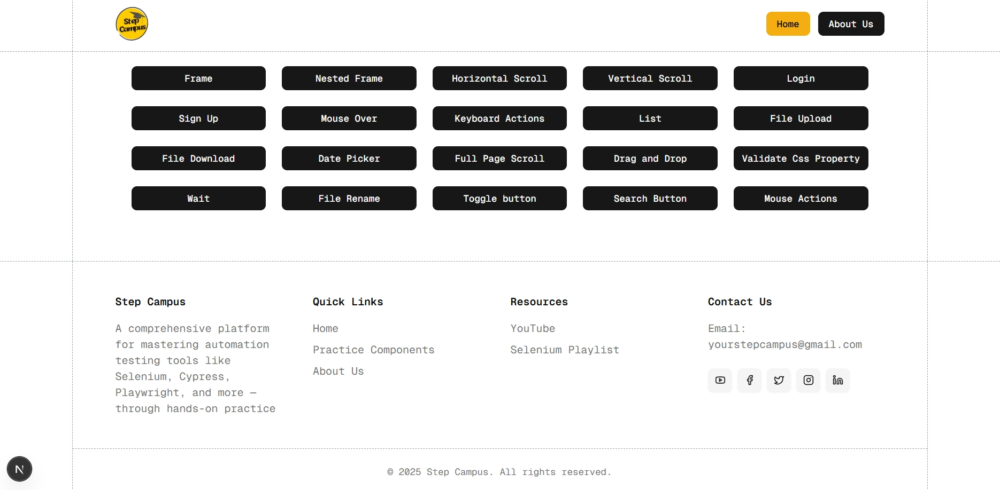
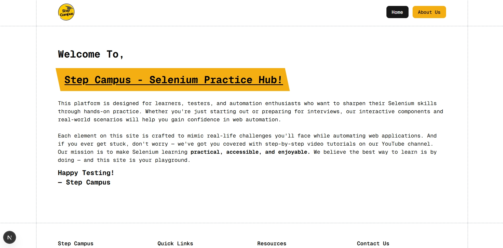
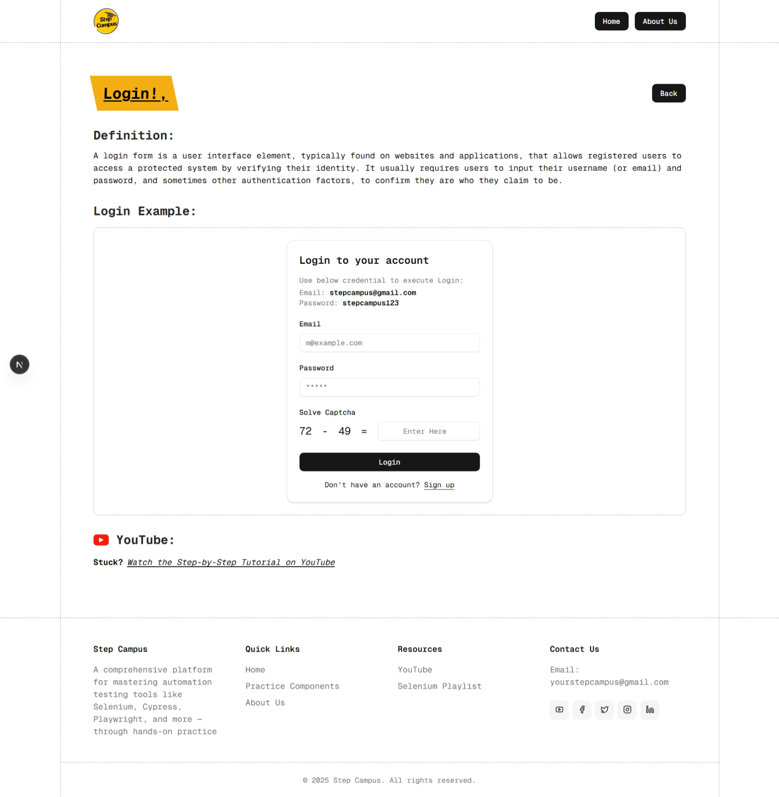
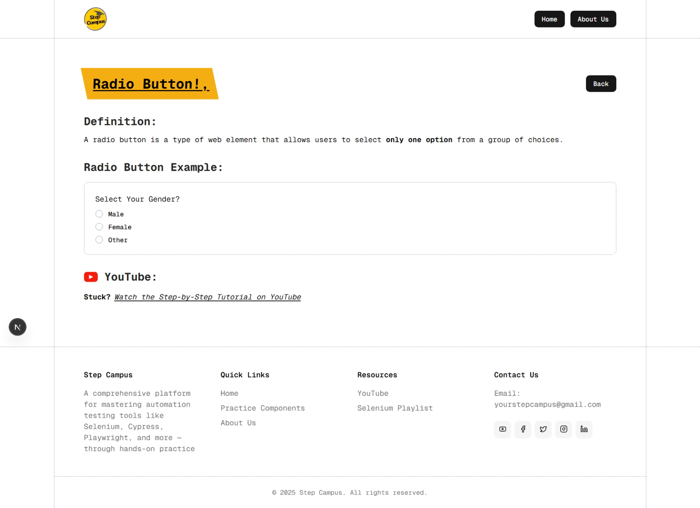

## Step Campus

Step Campus is a platform designed to help you master web automation with hands-on practice. It provides a rich set of UI components specifically created for testing and perfecting your Selenium scripts.

**Key Features:**

- Hands-on practice with real UI components
- Rich set of diverse UI elements for comprehensive testing
- Ideal for testing and perfecting your Selenium scripts

## Tech Stack

This project is built using the following technologies:

**Dependencies:**
- Next.js
- React
- @radix-ui/react (various components)
- class-variance-authority
- clsx
- cmdk
- date-fns
- lucide-react
- next-themes
- react-day-picker
- react-syntax-highlighter
- sonner
- tailwind-merge

**Dev Dependencies:**
- @tailwindcss/postcss
- @types/node
- @types/react
- @types/react-dom
- tailwindcss
- tw-animate-css
- typescript

## Demo









## Getting Started

First, run the development server:

```bash
npm run dev
# or
yarn dev
# or
pnpm dev
# or
bun dev
```

Open [http://localhost:3000](http://localhost:3000) with your browser to see the result.

You can start editing the page by modifying `app/page.tsx`. The page auto-updates as you edit the file.

This project uses [`next/font`](https://nextjs.org/docs/app/building-your-application/optimizing/fonts) to automatically optimize and load [Geist](https://vercel.com/font), a new font family for Vercel.

## Learn More

To learn more about Next.js, take a look at the following resources:

- [Next.js Documentation](https://nextjs.org/docs) - learn about Next.js features and API.
- [Learn Next.js](https://nextjs.org/learn) - an interactive Next.js tutorial.

You can check out [the Next.js GitHub repository](https://github.com/vercel/next.js) - your feedback and contributions are welcome!

## Deploy on Vercel

The easiest way to deploy your Next.js app is to use the [Vercel Platform](https://vercel.com/new?utm_medium=default-template&filter=next.js&utm_source=create-next-app&utm_campaign=create-next-app-readme) from the creators of Next.js.

Check out our [Next.js deployment documentation](https://nextjs.org/docs/app/building-your-application/deploying) for more details.
